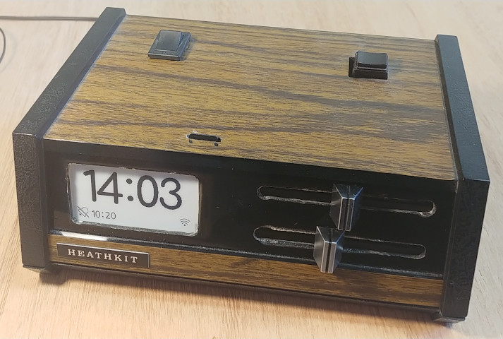
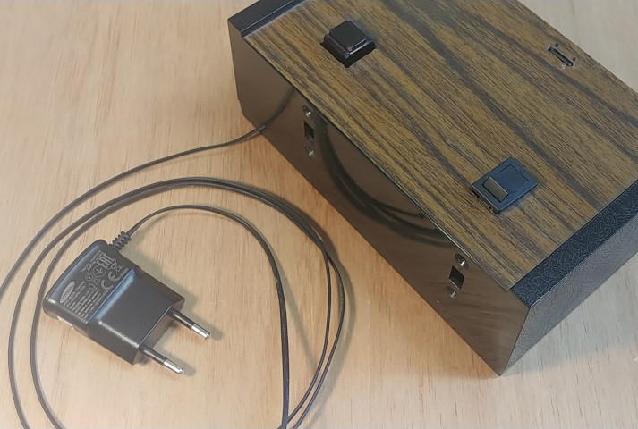
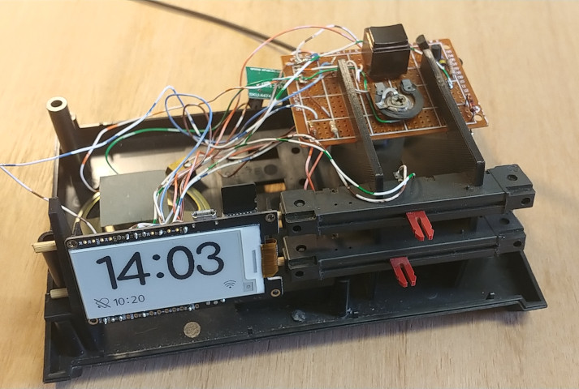
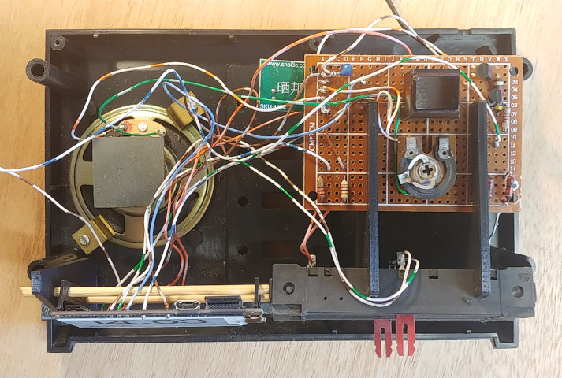
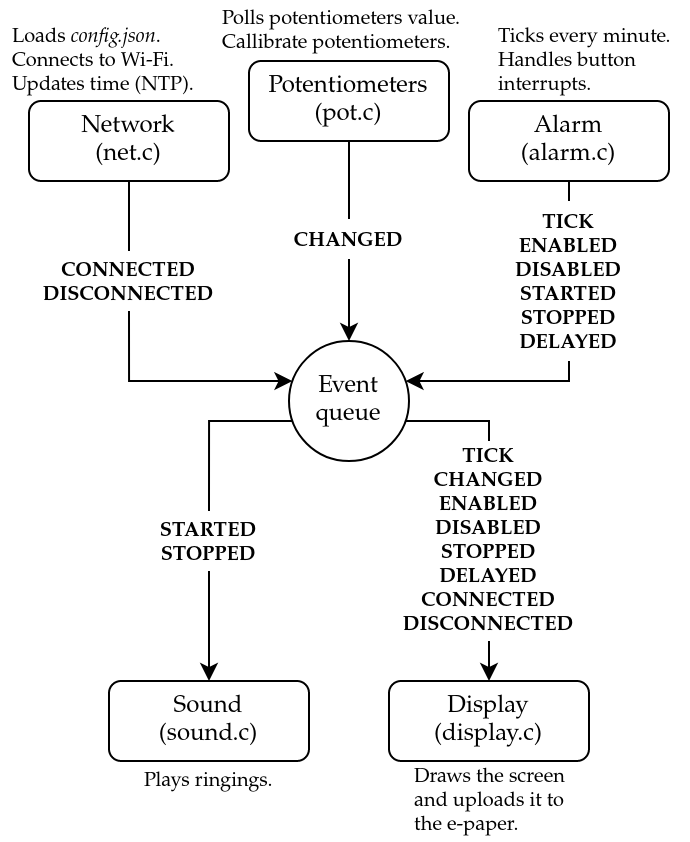
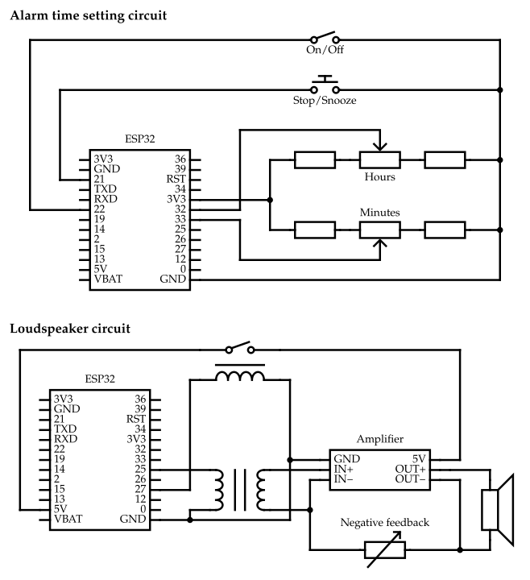

# ESP Alarm Clock

This is an alarm clock based on an ESP-32 microcontroller. It has the following features.

* An e-paper screen display.
* Potentiometers to set the alarm time (one for hours, the other for minutes).
* A potentiometers calibration procedure.
* A switch to activate or deactivate the alarm.
* A button to stop the alarm.
* The same button to snooze for 5 minutes if held down.
* Time update from the Internet via Wi-Fi.
* Automatic Wi-Fi reconnection.
* Streaming of ringings from an SD card.
* Random ringing selection.
* An over-engineered, multi-threaded, and real-time software.

I reused and adapted the housing of a fifty year old Heathkit GC-1005 from 1972. Some parts have been drilled, and supports have been 3D printed.









## Software

### Getting Started

The project has been made with ESP-IDF v4.3.2. The following commands can be used to compile and to setup the project. For more information, please refer to [Espressif's documentation](https://docs.espressif.com/projects/esp-idf/en/v4.3.2/esp32/index.html).

```sh
# Compile the software
idf.py build
# Flash the ESP-32 ROM
idf.py flash
# Print logs during execution
idf.py monitor
# Configure the project
idf.py menuconfig
```

The project has been configured with the default settings, except for the following.

```
Compiler options --> Optimization Level -> Optimize for performance (-O2)
Component config --> Wi-Fi --> WiFi NVS flash --> Off
Component config --> FAT Filesystem support --> Long filename buffer in heap
```

By default, the program will look for a *config.json* file at the root of the SD card. As for ringings, they can be placed in the *ringings* folder at the root of the file system. However, file paths (and GPIOs) can be configured in [config.h](./main/config.h).

### Config File

The *config.json* file takes the following form. Timezone setting follows [POSIX timezone format](https://www.gnu.org/software/libc/manual/html_node/TZ-Variable.html).

```json
{
    "wifi": {
        "ssid": "...",
        "password": "..."
    },
    "ntp": {
        "server": "pool.ntp.org",
        "timezone": "GMT"
    }
}
```

### Ringing Files

Ringing files must be encoded in raw PCM (mono channel, 8 bit samples, 44100 Hz rate). The alarm clock will randomly choose a ringing from the *ringings* directory every time the alarm rings.

### Architecture

The source code consists of different modules sending and receiving events. Each module covers a specific concern and run on separate threads.



## Hardware

The microcontroller I used is a [LILYGO® T5 V2.3.1 2.13"](./docs/T5_V2.3_2.13.jpg). It has a built-in [e-paper screen](./docs/GDEY0213B74.pdf) and microSD card reader. The unit is wired as shown in the following circuit diagrams.



## License

The project is under an [MIT license](./LICENSE).

© 2022, Pierre Luycx
